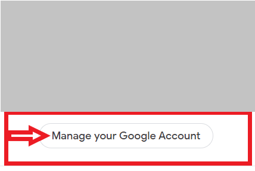
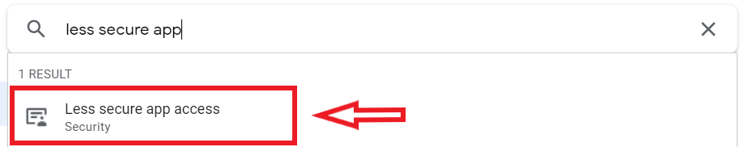
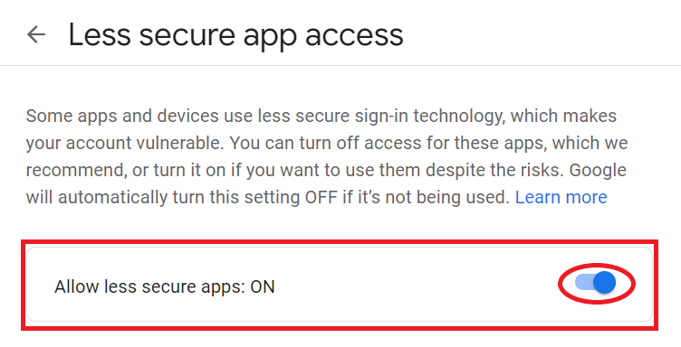

<h1 style="text-align:center;font-weight:700">Email Sender CLI</h1>

<h2>Made with</h2><hr>

- Node JS

- Commander JS

- Inquirer

<h2>Configuring Gmail Account</h2><hr>

<h3>Select Manage Account</h3>



<h3>Select Less Secure app access</h3>



<h3>Turn on to allow less secure app</h3>



<h2>Usage</h2>

```
$ esc --version
1.0.0

$ esc help
Usage :-
$ esc add   # Goes through a series of questions to send email.
$ esc ls    # Show last 5 sent emails

```
